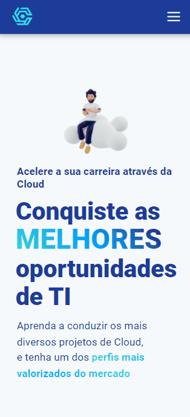

<h1> <a href="https://carreiracloud.com/"> Carreira Cloud </a></h1>

<p align="center">

</p>

<p align="center">

</p>

<p>In this code challenge I built a Web App integrated with Prismic CMS, to create posts in blog format.</p>

<h2> Requirements: </h2>
<ul>
    <li> Build a Web App using <b><i>NextJS</i></b> </li>
    <li> Integrate this app with a CMS for creating posts </li>
    <li> Integrate this app with MailChimp to receive email subscriptions </li>
    <li> The landing page must have three different sections to show customer information </li> 
</ul>

<h1> Testing this app </h1>

```bash
    # Clone repository
    $ git clone https://github.com/yagoramires/carreira-cloud-next.git
    # Access the repository folder
    $ cd carreira-cloud-next
    # Install the dependencies
    $ yarn
    # Run the application in development mode
    $ yarn dev
    # The server will start on port:3000 - access http://localhost:3000/
```

<h1> Author </h1>

<div align="center" >
    <p>
        
    </p>
    <p>
        <a
            href="https://www.linkedin.com/in/yagoramires/"
            target="_blank"
            >
            
        </a>
    </p>
    <p>
        <a href="https://github.com/yagoramires" ><b>Yago Ramires</b> 🚀</a>
    </p>
</div>

